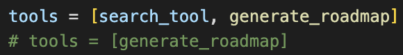
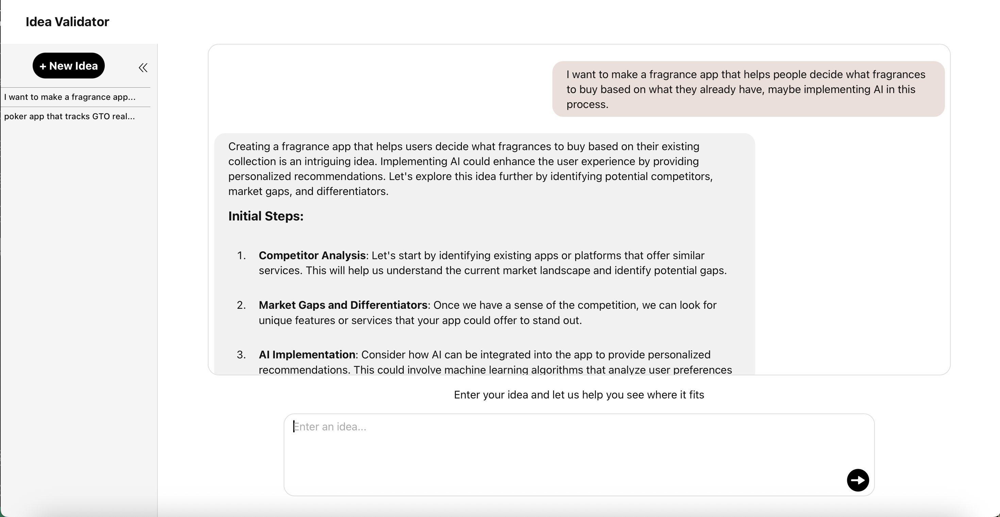
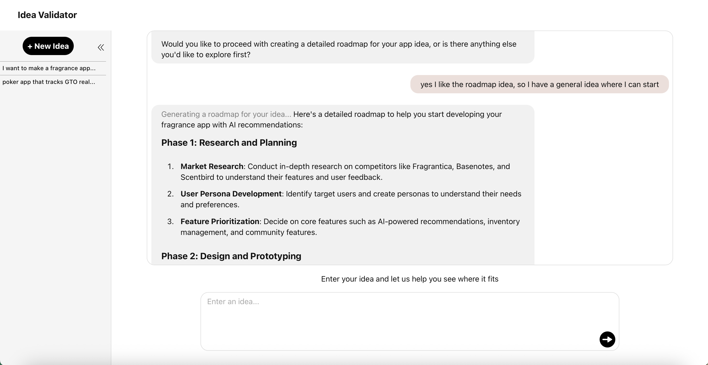
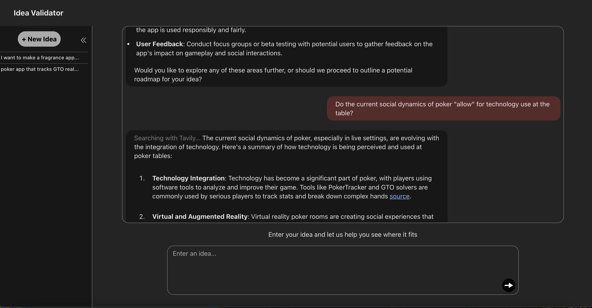
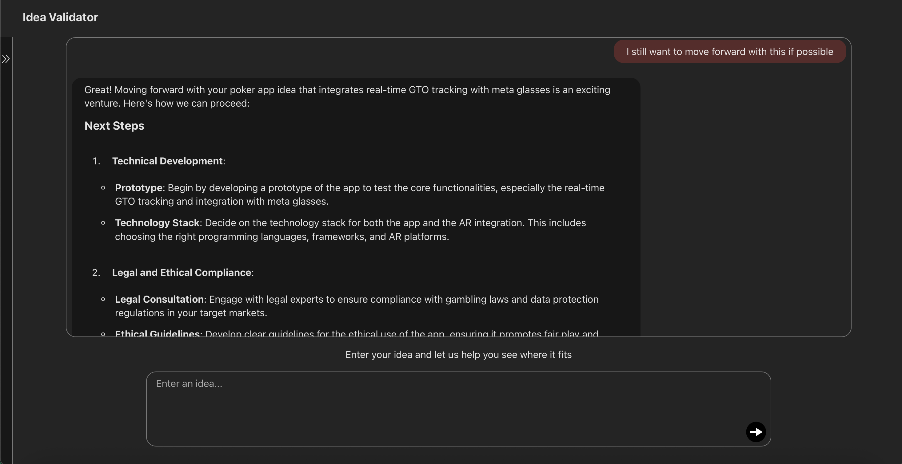

# Idea Validator

A strategic assistant that validates your new business ideas.

## Installation

Run the backend:
1. Navigate to the backend folder: ```cd ideavalidator-backend```
2. Make sure you have pip installed on your system for dependency installation (virtual enviornment may be necessary).
3. Install dependencies:  ```pip install -r requirements.txt```
4. Make sure the ```.env```, ```tools.py```, and ```agent.py``` files are configured properly. See the [APIs & Keys](#apis--keys) section to do this.
5. Run the backend: ```python main.py```

Run the frontend:
1. Open a fresh terminal.
2. Make sure you have Node.js and npm installed on your system.
3. Navigate to the frontend folder: ```cd ideavalidator-frontend```
4. Navigate to the application: ```cd idea-validator```
5. Install dependencies: ```npm install```
6. Run the application: ```npm run dev```

## APIs & Keys 
***STEP 1.***

- In order to run the application, you need to insert your API keys into the backend ```.env``` file.

***STEP 2.*** **(Only if you're using Claude)** 

- The ```run_agent_streaming()``` function in ```agent.py``` contains the logic for setting up the Agent. This backend is built to support OpenAI's GPT-4o.
Therefore, migrating to Claude may require adjustments for full compatibility.

***STEP 3.***

- In addition, the app uses the Tavily Search through Langchain. 

- **If you do not want to set up the separate key** needed for this, please **swap the comments** out shown on the image below in ```tools.py```. Please note if you do this, the agent may lag for a second while it looks for the tool that does not exist. This being said however, I took steps to gracefully handle this case via the system prompt.



**Otherwise**
- Go to the official [Tavily Documentation Quickstart page](https://docs.tavily.com/documentation/quickstart)
- Find the **“Get your free API key”** section.
- Follow the instructions from there to get a key (1000 free credits).
- Add this to the backend ```.env``` file.
- ```TAVILY_API_KEY=your-key-here```


## Usage

For using the app, simply type in an idea you are seeking to get more information about, and 
the AI will act as your strategic assistant in turning your idea into a reality.

Features:
- **Persistent Conversations**: Your previous ideas are stored in the sidebar and can be revisited anytime.
- **Start Fresh**: Easily begin a new conversation from the sidebar.
- **Live search**: Behind the scenes, the agent uses real-time search to find current market context and competitors.
- **Roadmap generator** After evaluating your idea, it can help build a step by step roadmap of navigating the idea.

See the screenshots below for example use-cases:
---



